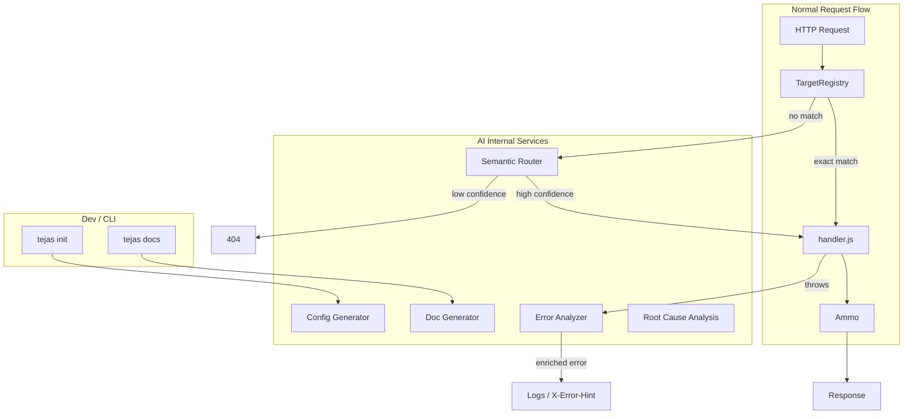

# AI-Native Framework: Internal AI Features

## What "AI Internally" Means

**Not:** A framework that lets developers call LLMs (`ammo.llm()`, chat endpoints, etc.)

**Yes:** A framework that **uses AI internally** to enhance its own capabilities. The framework itself is smarter—routing, errors, config, docs, and observability are powered by AI behind the scenes.

---

## Pain Points a Framework Can Solve by Using AI Internally

### 1. Useless Error Messages

**Pain:** "Cannot read property 'id' of undefined" — developer spends 20 minutes tracing where it came from.

**AI internally:** Framework catches the error, uses AI to analyze stack trace + request context + code, returns a **plain-language explanation** and **suggested fix** in the response or logs.

```
Error: User lookup failed in GET /users/:id
Cause: ammo.payload.id is undefined when id is "undefined" (string from query)
Fix: Validate route param before use: if (!ammo.payload.id) ammo.notFound();
```

### 2. Routing is Rigid

**Pain:** URLs must match exactly. Typos, alternate phrasings, or semantic equivalents (e.g. "user" vs "account") hit 404.

**AI internally:** **Semantic routing** — framework uses embeddings + intent matching to route requests to the right handler even when the path doesn't match literally. "Get my account info" could route to `/users/:id` when confidence is high. Low confidence → 404 or clarification.

### 3. Documentation is Always Stale

**Pain:** Docs drift from code. New routes, changed params, deprecated endpoints—docs don't reflect reality.

**AI internally:** Framework **auto-generates docs** from registered targets, handlers, and schemas. On startup or via CLI, it produces OpenAPI/JSON Schema. When code changes, docs update. Optional: natural language descriptions from JSDoc/comments.

### 4. Configuration is Guesswork

**Pain:** "What rate limit should I use?" "What body size?" Developers copy-paste from examples or guess.

**AI internally:** **Natural language config** — "I want to handle 1000 req/min with strict rate limiting" → framework uses AI to suggest `maxRequests: 1000`, `algorithm: 'token-bucket'`, etc. Or: **self-tuning** — framework observes traffic, suggests config changes (e.g. "Consider increasing BODY_MAX_SIZE based on observed payloads").

### 5. Debugging is Manual Correlation

**Pain:** Logs, traces, and errors are scattered. Developer manually correlates "this 500 at 3:42pm" with "this Redis timeout at 3:41pm."

**AI internally:** **AI-powered root cause analysis** — framework aggregates logs, traces, and metrics; uses AI to suggest "Likely cause: Redis connection dropped. See trace X. Suggested fix: check Redis URL and retry logic."

### 6. Malformed Input = Generic 400

**Pain:** Client sends `{ "name": 123 }` instead of `{ "name": "string" }`. Framework returns "Bad Request" with no guidance.

**AI internally:** **Intelligent validation errors** — AI suggests what the client likely meant: "Field 'name' expected string, got number. Did you mean to send a string? Example: { name: John }."

### 7. Recovery Requires Humans

**Pain:** Rate limit hit, DB timeout, or transient failure → 503. Human must retry or investigate.

**AI internally:** **Auto-remediation** — framework can attempt retries with backoff, fallback to cached response, or route to a degraded handler. Optional: "This looks like a transient DB error; retrying in 2s" and auto-retry before returning 503.

### 8. Security is Reactive

**Pain:** Unusual traffic patterns (DDoS, scraping, abuse) are detected only after damage.

**AI internally:** **Anomaly detection** — framework uses ML/AI on request patterns (IP, path, frequency, payload size) to flag anomalies. Can auto-trigger stricter rate limits, CAPTCHA, or alerting.

---

## Recommended Internal AI Features for Tejas

### Tier 1: High Impact, Clear Value

1. **Intelligent Error Responses**

- When `errorHandler` catches an error, optionally call AI with: stack trace, `ammo` context (path, method, payload keys), recent logs
- AI returns: human-readable cause, suggested fix, relevant doc link
- Attach to `LOG_EXCEPTIONS` output or optional `X-Error-Hint` header (dev only)
- Location: extend [server/handler.js](server/handler.js) `errorHandler`, new `utils/ai-error-analyzer.js`

1. **Semantic Routing (Optional Mode)**

- When exact `aim()` match fails, optionally use embeddings + intent registry to find best-matching target
- Each target can declare: `intents: ["get user", "fetch account", "user profile"]`
- Low confidence → fall through to 404
- Requires: embedding provider (OpenAI, local model), intent index
- Location: extend [server/targets/registry.js](server/targets/registry.js), new `server/targets/semantic-router.js`

1. **Auto-Generated Documentation**

- CLI or startup hook: `tejas docs` or `app.withAutoDocs()`
- Scans `targetRegistry.getAllEndpoints()`, infers schemas from handler patterns or explicit annotations
- Outputs OpenAPI spec, or serves `/docs` with interactive UI
- Optional: AI enhances descriptions from JSDoc
- Location: new `utils/auto-docs.js`, optional `docs/` route

### Tier 2: Developer Experience

1. **Natural Language Config**

- `app.configure("I need strict rate limiting for 500 req/min and 5MB body limit")`
- AI parses intent, returns config object; user can approve or edit
- Or: interactive `tejas init` that asks in plain language and generates `tejas.config.json`
- Location: new `utils/ai-config.js`, CLI

1. **Smart Validation Errors**

- When body-parser or validation fails, AI suggests corrections: "Expected 'email' as string; received number. Did you mean to send a string?"
- Integrates with existing body parsing in [server/ammo/body-parser.js](server/ammo/body-parser.js)
- Location: extend body-parser error path, new `utils/ai-validation-hint.js`

1. **Root Cause Analysis (Observability)**

- When `LOG_EXCEPTIONS` is on, batch recent logs and send to AI for correlation
- "Last 5 errors: Redis timeout, Redis timeout, DB connection refused. Likely cause: database connectivity. Check Redis URL."
- Can run as background job or on-demand via admin endpoint
- Location: new `utils/ai-rca.js`, optional admin target

### Tier 3: Advanced / Later

1. **Auto-Remediation**

- Configurable: on 503/timeout, framework retries N times with backoff before returning
- Or: fallback to cached/stale response when available
- Requires policy: "when X, do Y"
- Location: middleware or handler wrapper

1. **Anomaly Detection**

- Framework tracks request patterns; ML model (or rules) flags anomalies
- Triggers: alert, stricter rate limit, CAPTCHA challenge
- Heavier dependency; may be plugin
- Location: new `middlewares/anomaly-detector.js` (optional)

---

## Architecture: AI as Internal Service



**Design principle:** AI is **opt-in** and **configurable**. Each feature can be disabled. AI calls happen in the framework's own code paths, not in user handlers.

---

## Implementation Considerations

### When to Call AI

- **Synchronous (blocking):** Error analysis, validation hints — adds latency. Make it opt-in, async where possible (e.g. log enrichment in background).
- **Asynchronous (non-blocking):** Doc generation, config suggestion, RCA — run on CLI or cron, not per-request.

### Cost and Latency

- Every AI call costs money and adds latency. Features should be:
  - **Dev-only** where possible (error hints, config gen)
  - **Cached** (semantic route index, intent embeddings)
  - **Batchable** (RCA over last N errors, not per error)

### Provider Abstraction

- Framework needs one AI provider interface: `analyzeError(context)`, `matchIntent(query, intents)`, `suggestConfig(nl)`, etc.
- Pluggable: OpenAI, Anthropic, local Ollama, or disabled
- Config: `app.withAI({ provider: 'openai', apiKey: env('OPENAI_API_KEY'), features: ['errorAnalysis', 'semanticRouting'] })`

### Privacy and Security

- Never send sensitive data (tokens, passwords, PII) to AI without user consent
- Error analysis: sanitize stack traces, redact payload values
- Semantic routing: only path/headers, not body

---

## Summary: Pain Points Solved by Internal AI

| Pain Point                | Internal AI Feature        | User-Visible Benefit                 |
| ------------------------- | -------------------------- | ------------------------------------ |
| Useless errors            | Intelligent error analysis | Plain-language cause + suggested fix |
| Rigid routing             | Semantic routing           | Intent-based matching, fewer 404s    |
| Stale docs                | Auto-generated docs        | Always-in-sync OpenAPI, `/docs`      |
| Config guesswork          | Natural language config    | "I need X" → suggested config        |
| Manual debugging          | Root cause analysis        | Correlated insights from logs        |
| Generic validation errors | Smart validation hints     | "Did you mean...?" suggestions       |
| Human-only recovery       | Auto-remediation           | Retries, fallbacks, degraded mode    |
| Reactive security         | Anomaly detection          | Proactive abuse detection            |

---

## Next Steps (When Implementing)

1. **Error analysis** — highest impact, dev-only, no user code changes. Add `withAI({ features: ['errorAnalysis'] })`.
2. **Auto-docs** — no AI required for v1 (static from registry); add AI-enhanced descriptions later.
3. **Semantic routing** — requires intent registry and embeddings; good for apps with many similar routes.
4. **Natural language config** — CLI-only, great for `tejas init` experience.
