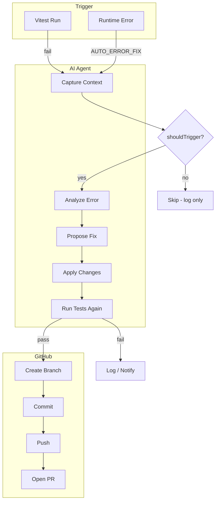

# Auto Error Fix Agent Plan

## Overview

When an error occurs—either a **test failure** or a **runtime exception**—an AI agent is triggered to:

1. Analyze the error (stack trace, context, failing code)
2. Propose and apply a fix
3. Create a branch, commit, push, and open a PR on GitHub

---

## Trigger Modes

| Mode                  | When                                                                                                                      | Use Case               |
| --------------------- | ------------------------------------------------------------------------------------------------------------------------- | ---------------------- |
| **Test failure**      | `npm run test:fix` or `tejas auto-fix` runs tests; on failure, agent triggers                                             | Local dev, CI pipeline |
| **Runtime exception** | Error caught in [server/handler.js](server/handler.js) `errorHandler`; if `AUTO_ERROR_FIX` enabled, enqueue agent (async) | Dev server only        |

**Recommendation:** Start with **test failure** mode. It's deterministic, reproducible, and doesn't add latency to request handling. Runtime mode can be added later as opt-in for dev.

---

## Architecture



---

## Components

### 1. Error Context Capture

**Inputs to collect:**

- Error message and stack trace
- Failing test name and file (if test failure)
- Test output (Vitest JSON reporter or stdout)
- Relevant source files (inferred from stack trace: file paths + line numbers)
- Request context for runtime errors: path, method, payload keys (sanitized)

**Output:** Structured JSON passed to the agent.

**Location:** `utils/auto-fix/context-capture.js`

### 2. AI Agent

**Responsibilities:**

- Receive error context
- Call LLM with: error details, relevant file contents, project structure
- LLM returns: proposed fix (file path, old code, new code) or "cannot fix"
- Parse and validate the response

**LLM prompt structure:**

- System: "You are an expert debugger. Fix the error. Return only the minimal change."
- User: Error + stack + file contents + "What change would fix this?"
- Response format: Structured (JSON) with `{ file, oldSnippet, newSnippet }` or `{ reason: "cannot fix" }`

**Provider:** Pluggable (OpenAI, Anthropic). Config: `AUTO_FIX_LLM_PROVIDER`, `OPENAI_API_KEY` or `ANTHROPIC_API_KEY`.

**Location:** `utils/auto-fix/agent.js`

### 3. Fix Applicator

**Responsibilities:**

- Take proposed fix (file, oldSnippet, newSnippet)
- Validate: oldSnippet exists in file (fuzzy match if whitespace differs)
- Apply: replace oldSnippet with newSnippet
- Run tests again
- If tests pass → proceed to PR; if fail → retry with feedback or abort

**Location:** `utils/auto-fix/apply-fix.js`

### 4. GitHub PR Creator

**Responsibilities:**

- Create branch: `auto-fix/error-{hash}` or `auto-fix/{short-description}`
- Stage changed files, commit with message: "fix: [error summary]"
- Push to origin
- Open PR via GitHub API with: title, body (error context + fix summary), base branch

**Requirements:**

- `GITHUB_TOKEN` (PAT with `repo` scope) or `GH_TOKEN`
- Git remote must be configured (e.g. `origin` → GitHub)
- Run from a clean or committed working tree (or stash first)

**Location:** `utils/auto-fix/github-pr.js`

### 5. CLI Entry Point

**Command:** `tejas auto-fix` or `npm run test:fix`

**Flow:**

1. Run `vitest run` (or `vitest run --reporter=json` for structured output)
2. If exit code 0 → done
3. If exit code !== 0 → capture context from Vitest output
4. Invoke agent → apply fix → verify
5. If verified → create PR
6. Print PR URL or "Fix applied locally" (if no GitHub config)

**Location:** `cli/auto-fix.js` or `scripts/auto-fix.js`; add to `package.json` scripts

---

## File Structure

```
te.js/
├── utils/
│   └── auto-fix/
│       ├── index.js           # Orchestrator
│       ├── should-trigger.js  # Error filter (include/exclude/predicate)
│       ├── context-capture.js # Capture error + test output
│       ├── agent.js           # LLM call, parse fix
│       ├── apply-fix.js       # Apply patch, re-run tests
│       └── github-pr.js       # Branch, commit, push, PR
├── cli/
│   └── auto-fix.js            # CLI entry (or bin in package.json)
└── package.json               # "test:fix": "node cli/auto-fix.js"
```

---

## Configuration

| Env / Config                           | Purpose                                          |
| -------------------------------------- | ------------------------------------------------ | ----------- |
| `AUTO_FIX_ENABLED`                     | Enable feature (default: false)                  |
| `AUTO_FIX_LLM_PROVIDER`                | `openai`                                         | `anthropic` |
| `OPENAI_API_KEY` / `ANTHROPIC_API_KEY` | LLM API key                                      |
| `GITHUB_TOKEN` / `GH_TOKEN`            | GitHub PAT for PR creation                       |
| `AUTO_FIX_CREATE_PR`                   | If true, create PR; if false, only apply locally |
| `AUTO_FIX_BASE_BRANCH`                 | Branch to target (default: current or `main`)    |

---

## Error Filtering: Developer Control

Developers must be able to control **which errors** trigger the auto-fix agent. Not every error should—e.g. 404s, auth failures, or intentional `TejError` throws may be undesirable.

### Filter Options

| Approach             | Config                            | Use Case                                |
| -------------------- | --------------------------------- | --------------------------------------- |
| **Include only**     | `autoFix.include`                 | Whitelist: only these trigger the agent |
| **Exclude**          | `autoFix.exclude`                 | Blacklist: never trigger for these      |
| **Custom predicate** | `autoFix.shouldFix(err, context)` | Full control via function               |

### Filter Criteria (for include/exclude)

| Criterion           | Example                                | Applies To        |
| ------------------- | -------------------------------------- | ----------------- |
| **Error name**      | `TypeError`, `TejError`                | Both modes        |
| **Status code**     | `500`, `404` (exclude 404)             | Runtime only      |
| **Message pattern** | Regex: `/ECONNREFUSED/`, `/not found/` | Both              |
| **File path**       | `server/`**, `!tests/`**               | Both (from stack) |
| **Route path**      | `/api/`, `!/auth/login`                | Runtime only      |
| **Test file**       | `**/*.test.js`, `!e2e/`                | Test failure only |

### Configuration Examples

**tejas.config.json:**

```json
{
  "autoFix": {
    "enabled": true,
    "include": {
      "errorNames": ["TypeError", "ReferenceError"],
      "statusCodes": [500],
      "filePatterns": ["server/**", "utils/**"]
    },
    "exclude": {
      "errorNames": ["TejError"],
      "statusCodes": [404, 401, 403],
      "messagePatterns": ["/ECONNREFUSED/", "/timeout/"],
      "routePatterns": ["/auth/**", "/health"]
    }
  }
}
```

**Programmatic (custom predicate):**

```javascript
// index.js or tejas.config.js
const app = new Tejas({
  autoFix: {
    enabled: true,
    shouldFix: (err, context) => {
      // Never fix auth or 404
      if (context.statusCode === 404 || context.statusCode === 401)
        return false;
      // Only fix errors in our source, not deps
      if (!context.stackFiles?.some((f) => f.startsWith("server/")))
        return false;
      // Skip "connection refused" - infra issue, not code
      if (/ECONNREFUSED|ETIMEDOUT/.test(err.message)) return false;
      return true;
    },
  },
});
```

### Filter Evaluation Order

1. If `shouldFix` is provided → call it; if it returns `false`, **do not trigger**
2. If `include` is set → error must match at least one include criterion; else **do not trigger**
3. If `exclude` is set → error must match none of the exclude criteria; else **do not trigger**
4. Default (no config): **trigger** for all errors (when auto-fix is enabled)

### Context Passed to `shouldFix`

```javascript
{
  error: Error,           // The thrown error
  errorName: string,      // e.g. "TypeError"
  message: string,
  stack: string,
  stackFiles: string[],   // File paths from stack trace
  statusCode?: number,    // Runtime: TejError.code or 500
  path?: string,          // Runtime: request path
  method?: string,        // Runtime: GET, POST, etc.
  testFile?: string,     // Test failure: failing test file
  testName?: string       // Test failure: failing test name
}
```

### Location

- Filter logic: `utils/auto-fix/should-trigger.js`
- Called from: context capture (before invoking agent) and `errorHandler` (before enqueue)
- Config loading: reuse `loadConfigFile` + `standardizeObj` from [utils/configuration.js](utils/configuration.js)

---

## Safety and Guardrails

1. **Never run in production** — Only when `NODE_ENV=development` or explicit `AUTO_FIX_ENABLED=true`
2. **Sanitize context** — Redact secrets, tokens, PII from error payloads before sending to LLM
3. **Human review** — Fix goes to PR, never auto-merge
4. **Retry limit** — Agent tries at most N times (e.g. 2) before giving up
5. **Scope** — Only modify files inferred from stack trace; never touch `node_modules`, `.git`, config files (unless error points there)

---

## Runtime Error Integration (Optional, Phase 2)

To trigger from runtime errors in [server/handler.js](server/handler.js):

1. In `errorHandler`, after logging: if `env('AUTO_ERROR_FIX')` and `env('NODE_ENV') === 'development'`, call `shouldTrigger(err, context)`. If true, call `enqueueAutoFix(ammo, err)` (non-blocking)
2. `enqueueAutoFix` pushes to an in-memory queue or spawns a detached child process
3. Child process runs the same agent flow with runtime context (path, method, stack, sanitized payload)
4. Same apply → verify → PR flow

**Caveat:** Runtime errors may be non-deterministic (e.g. race, bad input). Agent might not reproduce the fix. Test failure mode is more reliable.

---

## Dependencies

- **Git operations:** `simple-git` or Node's `child_process` + `git` CLI
- **GitHub API:** `@octokit/rest` or `fetch` to `https://api.github.com`
- **LLM:** `openai` SDK or `@anthropic-ai/sdk` (or fetch to provider APIs)
- **Vitest:** Already present; use `vitest run --reporter=json` for parseable output

---

## Implementation Order

1. **Should-trigger filter** — Config loading, include/exclude/predicate logic (needed by both modes)
2. **Context capture** — Parse Vitest failure output, extract stack + files
3. **Agent** — LLM integration, prompt design, structured response parsing
4. **Apply fix** — Patch application, re-run tests
5. **GitHub PR** — Branch, commit, push, create PR
6. **CLI** — Wire it all together, `tejas auto-fix`
7. **Runtime trigger** (optional) — Enqueue from errorHandler

---

## Example Usage

```bash
# After a test failure
$ npm run test:fix

# Output:
# Tests failed. Running auto-fix agent...
# Agent proposed fix for server/ammo.js
# Re-running tests... passed.
# Created PR: https://github.com/user/te.js/pull/42
```

```javascript
// In tejas.config.json (for runtime mode, phase 2)
{
  "autoFix": {
    "enabled": true,
    "createPr": true,
    "exclude": {
      "statusCodes": [404, 401, 403],
      "routePatterns": ["/auth/**"]
    }
  },
  "auto_fix_llm_provider": "openai"
}
```
