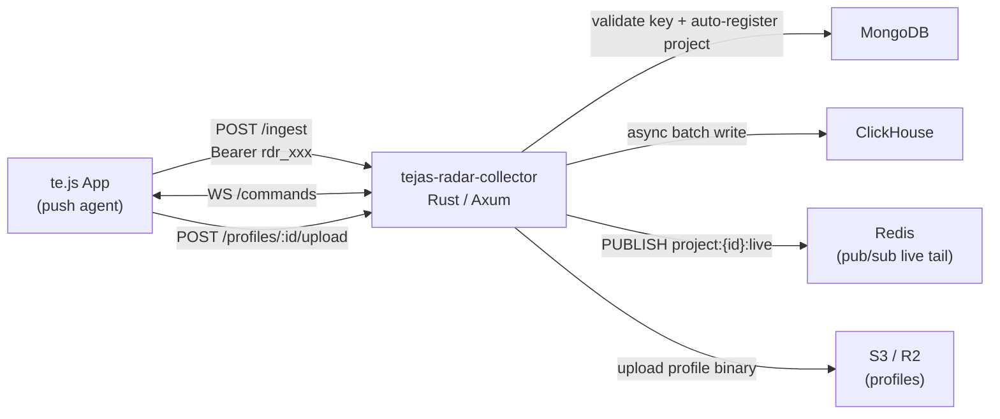

# Radar Collector Service

## Architecture



## Key Context

- API key format: `rdr_<64 hex chars>`. Stored as SHA-256 hash in MongoDB `api_keys` collection (`keyHash` field). Validation: SHA-256 the incoming key → lookup in MongoDB → LRU cache 60s TTL.
- Project auto-registration: on first ingest event for a `(projectName, accountId)` pair, insert into MongoDB `projects` collection.
- Ingest is fire-and-forget: events go into an in-memory `tokio::sync::mpsc` channel; a background Tokio task drains it to ClickHouse every 1s or when buffer hits 1000 events. HTTP response returns immediately.
- Redis publish: after buffering, publish raw event batch JSON to `project:{projectId}:live` so the Cloud API WebSocket live-tail can forward it.

## File Structure

```
tejas-radar-collector/
├── Cargo.toml
├── .env.example
└── src/
    ├── main.rs           — Axum router, startup, graceful shutdown
    ├── config.rs         — Env-var config struct (MONGO_URI, CLICKHOUSE_URL, REDIS_URL, S3_*, PORT)
    ├── state.rs          — AppState: MongoDB client, ClickHouse client, Redis, buffer tx, auth cache
    ├── auth.rs           — validate_api_key(): SHA-256 key → MongoDB lookup → LRU<String, AuthInfo> cache
    ├── buffer.rs         — EventBuffer: mpsc sender + Tokio task that flushes to ClickHouse + Redis
    ├── routes/
    │   ├── mod.rs
    │   ├── ingest.rs     — POST /ingest: auth → enqueue events → 202
    │   ├── commands.rs   — WS /commands: profiler bidirectional channel
    │   └── profiles.rs   — POST /profiles/:id/upload: stream body → S3/R2
    ├── db/
    │   ├── mod.rs
    │   ├── clickhouse.rs — table DDL, batch insert for each event type
    │   └── mongo.rs      — api_key lookup, project upsert, profiler_commands
    ├── models/
    │   ├── mod.rs
    │   └── event.rs      — #[serde] event types: MetricEvent, LogEvent, SpanEvent, ErrorEvent, RuntimeEvent
    ├── redis.rs          — publish_live(project_id, events) helper
    └── storage.rs        — upload_profile(key, data) using aws-sdk-s3 / object_store
```

## Cargo Dependencies

- `axum = "0.7"` (with `ws` feature for WebSocket)
- `tokio = { version = "1", features = ["full"] }`
- `serde = { version = "1", features = ["derive"] }`, `serde_json = "1"`
- `mongodb = "3"` (async, bson)
- `clickhouse = "0.13"` (official ClickHouse Rust client)
- `redis = { version = "0.27", features = ["tokio-comp"] }`
- `lru = "0.12"` + `std::sync::Mutex` for thread-safe auth cache
- `sha2 = "0.10"`, `hex = "0.4"` (key hashing)
- `tower-http = { version = "0.6", features = ["cors", "trace"] }`
- `uuid = { version = "1", features = ["v4"] }`
- `dotenvy = "0.15"` (`.env` file loading)
- `tracing = "0.1"`, `tracing-subscriber = { version = "0.3", features = ["env-filter"] }`
- `aws-sdk-s3 = "1"` (profile upload, feature-gated)
- `thiserror = "2"` (error enum)
- `axum-extra = { version = "0.9", features = ["typed-header"] }` (Bearer extraction)
- `headers = "0.4"` (Authorization header type)

## Endpoints

| Method | Path                          | Auth              | Behaviour                                      |
| ------ | ----------------------------- | ----------------- | ---------------------------------------------- |
| `GET`  | `/health`                     | none              | `200 { "ok": true }`                           |
| `POST` | `/ingest`                     | `Bearer rdr_xxx`  | Deserialise batch → enqueue → `202`            |
| `WS`   | `/commands`                   | `?apiKey=rdr_xxx` | Register instance, forward profiler commands   |
| `POST` | `/profiles/:profileId/upload` | `Bearer rdr_xxx`  | Stream to S3/R2, update MongoDB `profiles` doc |

## Ingest Payload (matches te.js push agent)

```json
[
  {
    "type": "metric",
    "projectName": "my-api",
    "method": "GET",
    "path": "/users",
    "status": 200,
    "duration_ms": 45,
    "payload_size": 0,
    "response_size": 1200,
    "timestamp": 1700000000000
  },
  {
    "type": "log",
    "projectName": "my-api",
    "ip": "1.2.3.4",
    "user_agent": "...",
    "headers": {},
    "error": null,
    "...": "...metric fields..."
  },
  {
    "type": "span",
    "projectName": "my-api",
    "traceId": "...",
    "spanId": "...",
    "parentId": null,
    "name": "handler:/users",
    "spanType": "handler",
    "startMs": 1700000000000,
    "duration_ms": 45,
    "status": 200,
    "metadata": {}
  },
  {
    "type": "error",
    "projectName": "my-api",
    "fingerprint": "sha256...",
    "message": "...",
    "stack": "...",
    "endpoint": "GET /users",
    "traceId": "...",
    "timestamp": 1700000000000
  },
  {
    "type": "runtime",
    "projectName": "my-api",
    "instanceId": "pid-1234",
    "heap_used": 50000000,
    "heap_total": 100000000,
    "rss": 120000000,
    "event_loop_lag": 0.8,
    "gc_pause_ms": 5,
    "cpu_user": 0.12,
    "cpu_system": 0.03,
    "timestamp": 1700000000000
  }
]
```

## ClickHouse Tables

Five tables, all with `ENGINE = MergeTree()` partitioned by `(project_id, toYYYYMM(timestamp))`:

- `logs` — request fields + trace_id, ip, user_agent, headers, error
- `spans` — trace_id, span_id, parent_id, name, span_type, start_ms, duration_ms, metadata
- `errors` — fingerprint, message, stack, endpoint, trace_id
- `runtime_metrics` — instance_id, heap_used, heap_total, rss, event_loop_lag, gc_pause_ms, cpu_user, cpu_system
- `error_groups` (materialized view over `errors`) — pre-aggregated counts by fingerprint

## Build Phases

**Phase 1 — Project scaffold:** `Cargo.toml`, `config.rs`, `main.rs` (bare Axum router + `/health`), `state.rs` skeleton, `.env.example`

**Phase 2 — Auth:** `auth.rs` validates `Bearer rdr_xxx` using SHA-256 → MongoDB `api_keys.keyHash` lookup → `LruCache<String, AuthInfo>` (60s TTL). `db/mongo.rs` MongoDB client with `api_key_by_hash()` and `upsert_project()`.

**Phase 3 — Event models + buffer:** `models/event.rs` serde types for all 5 event variants (tagged union on `"type"` field). `buffer.rs` with `mpsc::channel`, `EventBuffer::send()`, and background `flush_loop` Tokio task.

**Phase 4 — ClickHouse:** `db/clickhouse.rs` table DDL (CREATE TABLE IF NOT EXISTS on startup) + `insert_batch()` per table. Buffer flush loop routes each event type to the right table.

**Phase 5 — Redis live tail:** `redis.rs` with `publish_live(project_id, &[Event])`. Buffer flush loop calls this after every ClickHouse write.

**Phase 6 — POST /ingest route:** `routes/ingest.rs` wires auth, buffer enqueue, project auto-registration on first event.

**Phase 7 — WS /commands:** `routes/commands.rs` WebSocket handler, instance registry (`DashMap<String, mpsc::Sender>`), polls/receives `profiler_commands` from MongoDB and pushes to the right instance.

**Phase 8 — Profile upload:** `routes/profiles.rs` + `storage.rs` stream multipart body to S3/R2, update `profiles` collection status to `ready`.
