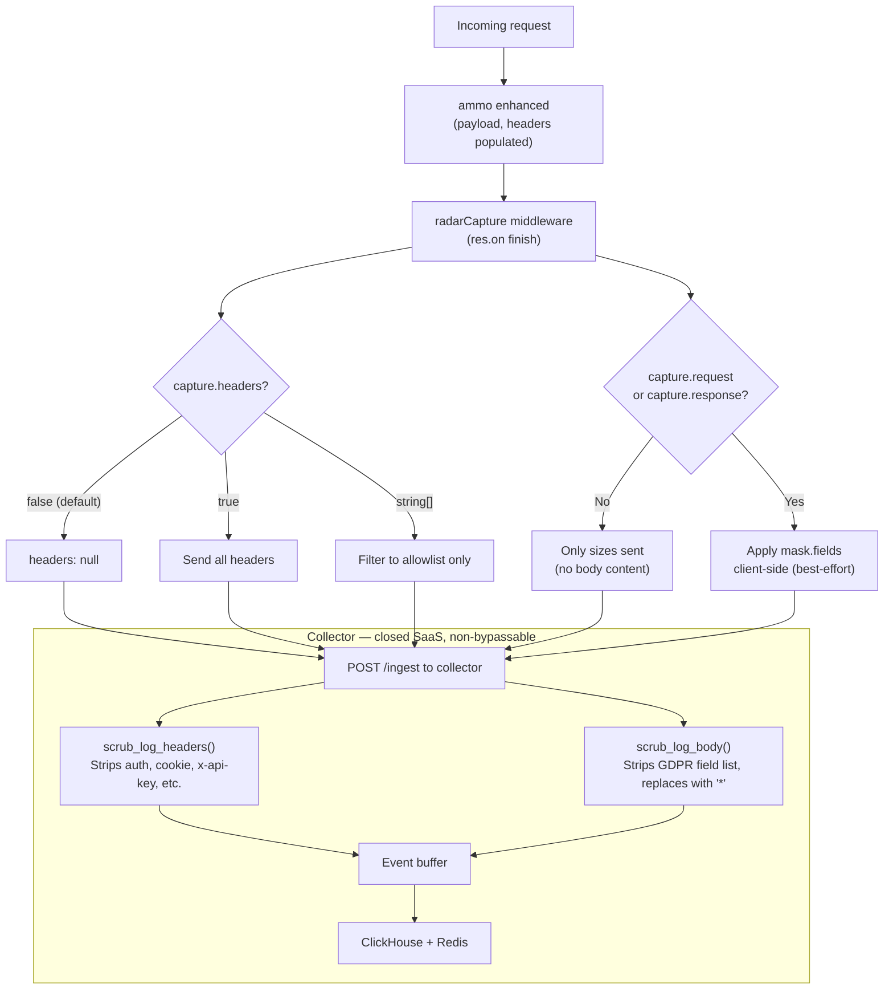

# Request/Response Body and Header Capture in Radar

## Background and Architecture Context

Radar is a telemetry system split across two separate codebases:

- `**te.js**` ([d:/Projects/te.js](d:/Projects/te.js)) — the open-source Node.js framework. It contains `radar/index.js`, a middleware that captures HTTP request metrics and ships them to the Radar collector in batches. Because this code is open source, any developer using `te.js` can read, fork, or modify it.
- `**tejas-radar-collector**` ([d:/Projects/tejas-radar-collector](d:/Projects/tejas-radar-collector)) — a closed-source Rust/Axum SaaS service that receives telemetry events, validates and sanitizes them, and writes them to ClickHouse (long-term storage) and Redis (live-tail). Developers using `te.js` have no access to this codebase.

Today, `radar/index.js` captures request metrics (method, path, status, duration, payload size, response size) but **never sends actual body content or headers** — those fields are hardcoded to `null`. This feature adds opt-in capture of request bodies, response bodies, and request headers, with GDPR-compliant masking built in.

---

## The Privacy Problem and Why a Two-Tier Approach is Required

When request/response bodies are captured and sent to an external telemetry service, there is a real risk of PII leaking into that service's storage — passwords, tokens, email addresses, credit card numbers, etc. The natural instinct is to add a field blocklist directly in `te.js` (`radar/index.js`) that masks sensitive fields before they are sent.

**However, this approach alone is insufficient for a GDPR guarantee**, because `te.js` is open source. Any developer can:

- Read the blocklist and know exactly which fields are masked and which are not.
- Fork the library and remove or bypass the masking logic before shipping to production.
- Patch the installed package locally.

This means a client-side blocklist in `te.js` can only ever be a **best-effort developer convenience**, not a security guarantee.

**The Radar collector, being a closed SaaS service, is where the guarantee must live.** Developers have no ability to read or modify its code. Any scrubbing logic enforced on the collector fires unconditionally on every ingest request, regardless of what version of `te.js` the client is running or whether they have modified it. This is the same principle already applied by the existing `scrub_log_headers()` function in `src/routes/ingest.rs` (lines 269–278), which strips sensitive HTTP headers server-side before they reach ClickHouse.

The result is a **two-tier model**:

| Tier                  | Where                               | Who controls it | Purpose                                                                                                                 |
| --------------------- | ----------------------------------- | --------------- | ----------------------------------------------------------------------------------------------------------------------- |
| Client-side masking   | `te.js` `radar/index.js`            | Developer       | Convenience — lets developers mask application-specific fields (e.g. `account_number`) before data leaves their process |
| Server-side scrubbing | `tejas-radar-collector` `ingest.rs` | Radar SaaS (us) | Non-bypassable GDPR guarantee — always fires, regardless of client behavior                                             |

---

## Current State

- `[radar/index.js](d:/Projects/te.js/radar/index.js)` line 144: `headers: null` — headers are never sent.
- `[radar/index.js](d:/Projects/te.js/radar/index.js)` lines 135–139: only `payload_size` / `response_size` sent — body content never sent.
- `[utils/request-logger.js](d:/Projects/te.js/utils/request-logger.js)` lines 22–25: logs full raw body to console with no masking.
- Collector `[src/routes/ingest.rs](d:/Projects/tejas-radar-collector/src/routes/ingest.rs)` lines 33–41 + 269–278: `SCRUBBED_HEADERS` + `scrub_log_headers()` already exist and work — but because `te.js` never sends headers today, this code is effectively dormant for the `headers` field.
- Collector `[src/models/event.rs](d:/Projects/tejas-radar-collector/src/models/event.rs)` line 113: `headers: Option<JsonValue>` already on `LogEvent`. No `request_body` / `response_body` fields yet.
- Collector `[src/db/clickhouse.rs](d:/Projects/tejas-radar-collector/src/db/clickhouse.rs)` line 121: `headers Nullable(String)` column already in the `logs` DDL. No body columns yet.

**Key files:**

- `[d:/Projects/te.js/radar/index.js](d:/Projects/te.js/radar/index.js)` — Radar middleware, metric record at lines 128–146
- `[d:/Projects/te.js/utils/request-logger.js](d:/Projects/te.js/utils/request-logger.js)` — Console logger, lines 22–25
- `[d:/Projects/te.js/te.js](d:/Projects/te.js/te.js)` — `withRadar()` JSDoc, lines 420–443
- `[d:/Projects/tejas-radar-collector/src/routes/ingest.rs](d:/Projects/tejas-radar-collector/src/routes/ingest.rs)` — `/ingest` handler + `scrub_log_headers()`, lines 33–278
- `[d:/Projects/tejas-radar-collector/src/models/event.rs](d:/Projects/tejas-radar-collector/src/models/event.rs)` — `LogEvent` struct, lines 93–129
- `[d:/Projects/tejas-radar-collector/src/db/clickhouse.rs](d:/Projects/tejas-radar-collector/src/db/clickhouse.rs)` — DDL + `LogRow`, lines 30–129

---

## Design

### Developer-facing configuration (`withRadar` in `te.js`)

```js
app.withRadar({
  apiKey: '...',
  capture: {
    request: true, // include request body (default: false)
    response: true, // include response body (default: false)
    headers: true, // include ALL request headers (default: false)
    headers: ['content-type', 'x-request-id'], // OR: include only specific headers
  },
  mask: {
    fields: ['internal_id', 'account_number'], // application-specific fields to mask client-side
  },
});
```

- All `capture` flags default to `false` — nothing new is sent unless explicitly enabled.
- `capture.headers: true` sends all headers; the collector will still scrub its fixed blocklist server-side.
- `capture.headers: string[]` sends only the listed header names — useful when only a few safe headers are needed (e.g. `content-type`, `x-request-id`).
- `mask.fields` is optional. It masks extra application-specific fields in the body before sending. These are fields the developer knows are sensitive in their own app but that are not on the universal GDPR list.

### Data flow



---

## Changes

### 1. `te.js` — `[radar/index.js](d:/Projects/te.js/radar/index.js)`

- Read `capture.headers`, `capture.request`, `capture.response`, and `mask.fields` from config.
- Build the `headers` field:
  - `false` (default) → `null`
  - `true` → `{ ...ammo.headers }` (full shallow copy)
  - `string[]` → object with only those keys picked from `ammo.headers`
- Build `request_body` and `response_body` with `mask.fields` applied if capture is enabled.
- Parse `ammo.dispatchedData` as JSON for `response_body`; fall back to `null` if not valid JSON (avoids sending raw unstructured text).

```js
headers: (() => {
  if (!captureHeaders) return null;
  if (captureHeaders === true) return { ...ammo.headers };
  return Object.fromEntries(
    captureHeaders.map(k => [k, ammo.headers?.[k.toLowerCase()]]).filter(([, v]) => v != null)
  );
})(),

request_body:  capture.request  ? applyClientMask(ammo.payload, maskFields)  : null,
response_body: capture.response ? applyClientMask(parsedResponse, maskFields) : null,
```

### 2. `tejas-radar-collector` — `[src/models/event.rs](d:/Projects/tejas-radar-collector/src/models/event.rs)`

Add two optional fields to `LogEvent` (the `headers` field already exists at line 113):

```rust
pub request_body: Option<JsonValue>,
pub response_body: Option<JsonValue>,
```

Add `MAX_JSON_BLOB` (8 KB) size validation for both new fields in `LogEvent::validate()`.

### 3. `tejas-radar-collector` — `[src/routes/ingest.rs](d:/Projects/tejas-radar-collector/src/routes/ingest.rs)`

The existing `scrub_log_headers()` (lines 269–278) requires no changes — it already fires on every `LogEvent` and will now actually scrub headers that te.js starts sending.

Add `SCRUBBED_BODY_FIELDS` and `scrub_log_body()`, following the exact same pattern:

```rust
const SCRUBBED_BODY_FIELDS: &[&str] = &[
    "password", "passwd", "secret", "token", "api_key", "apikey",
    "authorization", "auth", "credit_card", "card_number", "cvv",
    "ssn", "email", "phone", "mobile", "otp", "pin",
    "dob", "date_of_birth", "address",
];

fn scrub_log_body(log: &mut LogEvent) {
    scrub_json_value(&mut log.request_body, SCRUBBED_BODY_FIELDS);
    scrub_json_value(&mut log.response_body, SCRUBBED_BODY_FIELDS);
}

fn scrub_json_value(field: &mut Option<JsonValue>, blocklist: &[&str]) {
    // recursive walk — replaces matched key values with "*"
}
```

Call `scrub_log_body(log)` in the ingest handler immediately after the existing `scrub_log_headers(log)` call (line 131).

### 4. `tejas-radar-collector` — `[src/db/clickhouse.rs](d:/Projects/tejas-radar-collector/src/db/clickhouse.rs)`

Add two columns to the `logs` table DDL (lines 108–128):

```sql
request_body  Nullable(String),
response_body Nullable(String)
```

Add the fields to the `LogRow` struct (line 31) and populate them in the `IngestEvent::Log` match arm (line 268):

```rust
request_body:  e.request_body.as_ref().map(|b| b.to_string()),
response_body: e.response_body.as_ref().map(|b| b.to_string()),
```

### 5. `te.js` — `[utils/request-logger.js](d:/Projects/te.js/utils/request-logger.js)`

Apply best-effort masking to `ammo.payload` and `ammo.dispatchedData` before logging to console. Since the console logger has no config object, use a small hardcoded set (`password`, `token`, `secret`, `authorization`) as a safety net. This is separate from Radar and has no collector-side enforcement, so it is explicitly best-effort.

### 6. `te.js` — `[te.js](d:/Projects/te.js/te.js)`

Document `config.capture.request`, `config.capture.response`, `config.capture.headers`, and `config.mask.fields` in the `withRadar()` JSDoc block (lines 420–443).

---

## GDPR compliance summary

- **Opt-in only** — all `capture` flags default to `false`; no body or header content is ever sent unless a developer explicitly enables it.
- **Header allowlist** — `capture.headers: string[]` ensures only explicitly named headers are sent; accidental header leakage is structurally prevented.
- **Non-JSON bodies never stored** — the collector stores `null` for any body that is not valid JSON, preventing raw unstructured text (which may contain PII in unpredictable formats) from reaching storage.
- **Client-side masking (best-effort)** — `mask.fields` in te.js lets developers mask application-specific fields before data leaves their process. Useful and encouraged, but not a GDPR guarantee since te.js is open source.
- **Server-side header scrubbing (non-bypassable)** — `scrub_log_headers()` on the collector always strips `authorization`, `cookie`, `set-cookie`, `x-api-key`, `x-auth-token`, `x-csrf-token`, `proxy-authorization` before storage. Already exists; activated fully by this change.
- **Server-side body scrubbing (non-bypassable)** — new `scrub_log_body()` on the collector always replaces the GDPR field list values with `"*"` before ClickHouse/Redis. Cannot be bypassed from the client.
